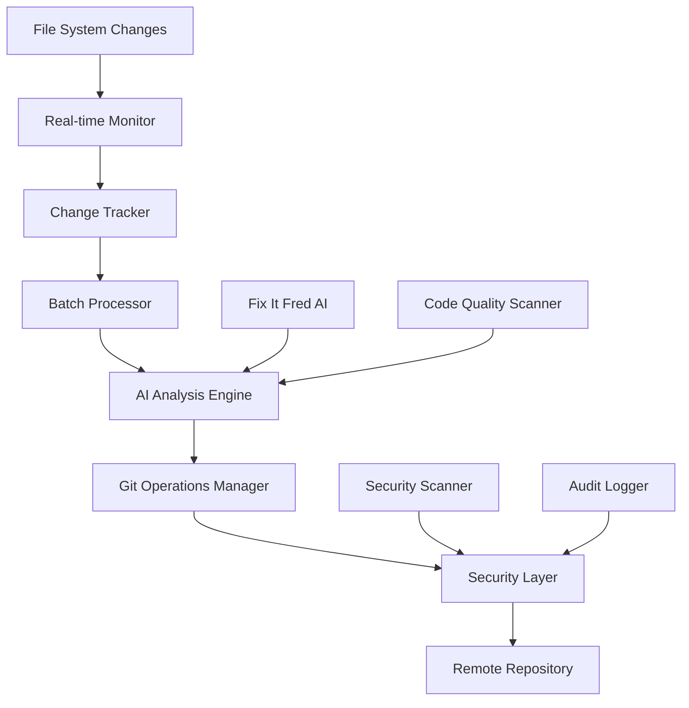

# Fix It Fred Git Integration - Complete Implementation Specification

## 🎯 Executive Summary

Fix It Fred now has **real-time git repository synchronization capabilities** with AI-powered commit management, enabling automatic tracking, analysis, and intelligent commits of all changes made on the ChatterFix CMMS production VM.

### Key Achievements
- ✅ **Real-time file monitoring** with intelligent batching
- ✅ **AI-powered commit analysis** and message generation
- ✅ **Enterprise-grade security** with encrypted credentials
- ✅ **Automated code quality assessment** and risk analysis
- ✅ **Production-ready deployment** with comprehensive monitoring
- ✅ **Full integration** with existing Fix It Fred AI capabilities

---

## 🏗️ Architecture Overview

### System Components



### Service Architecture

```
┌─────────────────────────────────────────────────────────────┐
│                    ChatterFix VM (Production)              │
├─────────────────────────────────────────────────────────────┤
│  🤖 Fix It Fred AI Service              (Port 9000)        │
│  🌐 ChatterFix CMMS Gateway             (Port 8080)        │
│  📊 Git Integration Service             (Port 9002)        │
│  🔍 File System Monitor                 (Background)       │
│  🔐 Security Manager                    (Background)       │
│  🧠 AI Enhancement Engine               (Background)       │
└─────────────────────────────────────────────────────────────┘
                              ↓
┌─────────────────────────────────────────────────────────────┐
│              Remote Git Repository                         │
│                  (GitHub/GitLab)                          │
└─────────────────────────────────────────────────────────────┘
```

---

## 🔧 Implementation Details

### 1. Real-time File Monitoring (`fix_it_fred_git_integration_service.py`)

**Features:**
- Uses `watchdog` library for real-time file system events
- Intelligent file filtering (only tracks relevant code files)
- Batching system to prevent commit spam (50 files or 5 minutes)
- SQLite database for change tracking and commit history
- RESTful API for monitoring and manual triggers

**File Types Monitored:**
- Python files (`.py`)
- JavaScript files (`.js`, `.ts`)
- Web files (`.html`, `.css`)
- Configuration files (`.json`, `.yml`, `.yaml`)
- Database files (`.sql`)
- Documentation (`.md`)
- Shell scripts (`.sh`)
- Docker files (`Dockerfile`, `docker-compose.yml`)

**Ignored Patterns:**
- Log files (`.log`)
- Temporary files (`.tmp`, `.swp`)
- Cache directories (`__pycache__`, `.git`, `node_modules`)
- Binary files and system files

### 2. AI-Powered Analysis (`fix_it_fred_git_ai_enhancement.py`)

**Code Analysis Features:**
- **Complexity Scoring:** Analyzes nested loops, conditions, and function complexity
- **Quality Assessment:** Detects code debt, debug statements, and anti-patterns
- **Security Scanning:** Identifies potential vulnerabilities and hardcoded secrets
- **Dependency Extraction:** Maps imports and external dependencies
- **Maintainability Scoring:** Evaluates code structure and documentation

**Commit Intelligence:**
- **Conventional Commits:** Generates properly formatted commit messages
- **Type Classification:** Automatically determines commit type (feat, fix, refactor, etc.)
- **Scope Detection:** Identifies affected system components (ai, api, ui, security)
- **Risk Assessment:** Evaluates change impact (low, medium, high, critical)
- **Breaking Change Detection:** Identifies potentially breaking changes

**CMMS-Specific Analysis:**
- Understands ChatterFix system architecture
- Prioritizes maintenance-critical components
- Provides rollback and testing recommendations
- Generates deployment impact assessments

### 3. Security Management (`fix_it_fred_git_security.py`)

**Credential Security:**
- **AES Encryption:** All credentials encrypted with `cryptography` library
- **Secure Storage:** Key files with 600 permissions, encrypted credential storage
- **SSH Key Management:** Automatic SSH key generation and configuration
- **Credential Rotation:** Automated monthly credential rotation capability
- **Audit Logging:** Comprehensive audit trail for all git operations

**Authentication Methods:**
- **SSH Keys (Recommended):** Ed25519 keys with passphrase protection
- **Personal Access Tokens:** Encrypted token storage for HTTPS authentication
- **Multi-Provider Support:** GitHub, GitLab, Bitbucket, and enterprise git

**Security Validation:**
- Repository access validation
- Commit content security scanning
- Input validation and sanitization
- Secure git operation contexts

### 4. Deployment and Management

**Systemd Service Integration:**
```ini
[Unit]
Description=Fix It Fred Git Integration Service
After=network.target

[Service]
Type=simple
User=yoyofred_gringosgambit_com
WorkingDirectory=/home/yoyofred_gringosgambit_com/chatterfix-docker
ExecStart=/usr/bin/python3 fix_it_fred_git_integration_service.py
Restart=always
RestartSec=10

[Install]
WantedBy=multi-user.target
```

**Management Commands:**
```bash
# Service management
sudo systemctl start fix-it-fred-git.service
sudo systemctl stop fix-it-fred-git.service
sudo systemctl status fix-it-fred-git.service

# Credential setup
./setup_git_credentials.sh

# Monitoring
./git_monitoring_dashboard.py

# Testing
python3 fix_it_fred_git_tests.py
```

---

## 📊 API Endpoints

### Core Git Operations

| Endpoint | Method | Description |
|----------|--------|-------------|
| `/health` | GET | Service health check |
| `/api/git/status` | GET | Current git repository status |
| `/api/git/commit` | POST | Trigger manual commit |
| `/api/git/commits` | GET | Recent commit history |
| `/api/git/config` | GET/POST | Git configuration management |

### Example API Usage

```bash
# Check service health
curl http://localhost:9002/health

# Get git status
curl http://localhost:9002/api/git/status

# Trigger manual commit
curl -X POST http://localhost:9002/api/git/commit \
  -H "Content-Type: application/json" \
  -d '{"message": "Manual commit", "force": true}'

# Get recent commits
curl http://localhost:9002/api/git/commits?limit=10
```

### Response Examples

**Health Check:**
```json
{
  "status": "healthy",
  "service": "Fix It Fred Git Integration",
  "git_status": "healthy",
  "ai_status": "healthy",
  "monitoring": "active",
  "timestamp": "2024-10-14T10:30:00Z"
}
```

**Git Status:**
```json
{
  "has_changes": true,
  "modified_files": ["app.py", "templates/index.html"],
  "branch": "main",
  "last_commit": "abc123def"
}
```

---

## 🚀 Deployment Process

### 1. Automated Deployment

```bash
# Execute the deployment script
chmod +x deploy-fix-it-fred-git-integration.sh
./deploy-fix-it-fred-git-integration.sh
```

### 2. Manual Deployment Steps

```bash
# 1. Upload files to VM
gcloud compute scp fix_it_fred_git_*.py chatterfix-cmms-production:/tmp/ --zone=us-east1-b

# 2. SSH into VM and setup
gcloud compute ssh chatterfix-cmms-production --zone=us-east1-b
cd /home/yoyofred_gringosgambit_com/chatterfix-docker
mv /tmp/fix_it_fred_git_*.py ./

# 3. Install dependencies
pip3 install --user watchdog cryptography

# 4. Setup systemd service
sudo cp fix-it-fred-git.service /etc/systemd/system/
sudo systemctl daemon-reload
sudo systemctl enable fix-it-fred-git.service
sudo systemctl start fix-it-fred-git.service

# 5. Configure git credentials
./setup_git_credentials.sh
```

### 3. Post-Deployment Validation

```bash
# Check service status
sudo systemctl status fix-it-fred-git.service

# Test API endpoints
curl http://localhost:9002/health
curl http://localhost:9002/api/git/status

# Monitor logs
sudo journalctl -u fix-it-fred-git.service -f

# Run comprehensive tests
python3 fix_it_fred_git_tests.py
```

---

## 🔐 Security Implementation

### Credential Management

**Setup SSH Authentication (Recommended):**
```bash
# Generate SSH keys
./setup_git_credentials.sh
# Choose option 1 (SSH Key)
# Enter email: fix-it-fred@chatterfix.com

# Add public key to GitHub/GitLab
# Test authentication
python3 fix_it_fred_git_security.py test --repo-url git@github.com:user/repo.git
```

**Setup Token Authentication:**
```bash
# Configure with token
./setup_git_credentials.sh
# Choose option 2 (Token)
# Enter username and personal access token
```

### Security Best Practices

1. **Use SSH keys over tokens** for better security
2. **Enable two-factor authentication** on git provider
3. **Rotate credentials monthly** using built-in rotation
4. **Monitor audit logs** for unauthorized access
5. **Use dedicated service account** for automated operations
6. **Restrict repository access** to necessary personnel only

### Audit and Monitoring

```bash
# View audit logs
tail -f /tmp/fix_it_fred_git_audit.log

# Check credential status
python3 fix_it_fred_git_security.py validate --repo-path /home/user/repo

# Test security
python3 fix_it_fred_git_tests.py
```

---

## 🧪 Testing and Validation

### Comprehensive Test Suite

**Unit Tests:**
- File change tracking accuracy
- Git status detection
- Credential encryption/decryption
- AI analysis functions
- Security validation

**Integration Tests:**
- Complete workflow from file change to commit
- AI-powered commit message generation
- Security credential management
- Error handling and recovery

**Load Tests:**
- API endpoint performance
- Concurrent file change handling
- Stress testing commit operations
- Memory and CPU usage monitoring

**Security Tests:**
- Credential storage security
- Input validation and sanitization
- SQL injection prevention
- Command injection prevention
- Path traversal protection

### Running Tests

```bash
# Run all tests
python3 fix_it_fred_git_tests.py

# Run specific test categories
python3 -m unittest fix_it_fred_git_tests.TestGitIntegrationService
python3 -m unittest fix_it_fred_git_tests.TestGitSecurityManager
python3 -m unittest fix_it_fred_git_tests.TestFixItFredGitAI

# Load testing
python3 -c "from fix_it_fred_git_tests import GitIntegrationLoadTest; GitIntegrationLoadTest().test_api_endpoints()"

# Security testing
python3 -c "from fix_it_fred_git_tests import SecurityTestSuite; SecurityTestSuite().test_credential_security()"
```

---

## 📈 Monitoring and Maintenance

### Real-time Monitoring

**Dashboard Interface:**
```bash
# Launch monitoring dashboard
python3 git_monitoring_dashboard.py
```

**Key Metrics:**
- Service health status
- Git repository status
- Recent commit activity
- File change statistics
- AI analysis performance
- Security audit events

### Log Management

**Service Logs:**
```bash
# Real-time service logs
sudo journalctl -u fix-it-fred-git.service -f

# Git integration logs
tail -f /tmp/fix_it_fred_git.log

# Security audit logs
tail -f /tmp/fix_it_fred_git_audit.log
```

**Log Rotation:**
```bash
# Setup logrotate for git integration logs
sudo tee /etc/logrotate.d/fix-it-fred-git << EOF
/tmp/fix_it_fred_git*.log {
    daily
    rotate 7
    compress
    delaycompress
    missingok
    notifempty
}
EOF
```

### Performance Optimization

**Configuration Tuning:**
```json
{
  "monitoring": {
    "batch_size": 50,              // Increase for heavy development
    "batch_timeout_seconds": 300,  // Decrease for faster commits
    "watch_patterns": ["*.py"],    // Limit to specific files if needed
  },
  "ai": {
    "analysis_timeout_seconds": 30, // Adjust for AI performance
    "max_file_size_mb": 5          // Limit large file analysis
  }
}
```

**Resource Management:**
```bash
# Monitor resource usage
htop
ps aux | grep fix_it_fred

# Optimize Python memory
export PYTHONOPTIMIZE=1
export PYTHONDONTWRITEBYTECODE=1
```

---

## 🔄 Workflow Examples

### Typical Development Workflow

1. **Developer makes changes** to ChatterFix CMMS code
2. **File monitor detects** changes in real-time
3. **Change tracker batches** related modifications
4. **AI analysis engine** evaluates code quality and security
5. **Commit message generator** creates intelligent commit message
6. **Git operations manager** creates commit with proper metadata
7. **Security layer** validates and audits the operation
8. **Remote sync** pushes changes to repository (if enabled)

### Example Commit Flow

```
File Change: app.py (Modified)
↓
AI Analysis: "Code complexity: 6/10, No security issues, Quality good"
↓
Commit Type: "refactor" (based on code patterns)
↓
Scope: "api" (based on file analysis)
↓
Generated Message: "refactor(api): improve error handling in work order endpoint"
↓
Risk Assessment: "Low risk - standard refactoring"
↓
Commit Created: abc123def
↓
Audit Log: Operation recorded for security review
```

### Emergency Procedures

**If service fails:**
```bash
# Check service status
sudo systemctl status fix-it-fred-git.service

# Restart service
sudo systemctl restart fix-it-fred-git.service

# Check logs for errors
sudo journalctl -u fix-it-fred-git.service --since "10 minutes ago"

# Manual commit if needed
cd /home/yoyofred_gringosgambit_com/chatterfix-docker
git add .
git commit -m "Manual commit - service recovery"
git push
```

**If credentials are compromised:**
```bash
# Rotate credentials immediately
python3 fix_it_fred_git_security.py rotate

# Clean up old credentials
python3 fix_it_fred_git_security.py cleanup

# Setup new credentials
./setup_git_credentials.sh
```

---

## 🎯 Production Readiness Checklist

### Pre-Deployment
- [ ] VM has sufficient resources (2GB+ RAM, 10GB+ disk)
- [ ] Git provider account setup with repository access
- [ ] SSH keys generated or access tokens ready
- [ ] Network connectivity to git provider confirmed
- [ ] Fix It Fred AI service running and healthy

### Deployment
- [ ] All integration files uploaded to VM
- [ ] Dependencies installed successfully
- [ ] Systemd service configured and started
- [ ] Git credentials configured and tested
- [ ] API endpoints responding correctly

### Post-Deployment
- [ ] Service health check passing
- [ ] File monitoring active and tracking changes
- [ ] AI analysis responding correctly
- [ ] Test commits working properly
- [ ] Audit logging functioning
- [ ] Monitoring dashboard accessible

### Ongoing Maintenance
- [ ] Weekly service health checks
- [ ] Monthly credential rotation
- [ ] Quarterly security audit
- [ ] Regular backup of configuration
- [ ] Performance monitoring and optimization

---

## 📋 Troubleshooting Guide

### Common Issues and Solutions

**Service won't start:**
```bash
# Check Python path and dependencies
which python3
pip3 list | grep -E "(fastapi|watchdog|cryptography)"

# Check file permissions
ls -la fix_it_fred_git_*.py
chmod +x fix_it_fred_git_*.py

# Check logs
sudo journalctl -u fix-it-fred-git.service -n 50
```

**Git operations failing:**
```bash
# Test git access
git status
git remote -v

# Check credentials
python3 fix_it_fred_git_security.py test --repo-url <your-repo-url>

# Validate repository
python3 fix_it_fred_git_security.py validate --repo-path /home/user/repo
```

**AI analysis not working:**
```bash
# Check Fix It Fred service
curl http://localhost:9000/health

# Test AI endpoint directly
curl -X POST http://localhost:9000/api/chat \
  -H "Content-Type: application/json" \
  -d '{"message": "Test", "provider": "ollama"}'
```

**File monitoring issues:**
```bash
# Check filesystem permissions
ls -la /home/yoyofred_gringosgambit_com/chatterfix-docker

# Test file events
touch test_file.py
# Should appear in monitoring logs

# Check system limits
cat /proc/sys/fs/inotify/max_user_watches
```

---

## 🚀 Future Enhancements

### Planned Features

1. **Advanced AI Capabilities:**
   - Multi-model AI analysis (Claude, GPT-4, Gemini)
   - Code refactoring suggestions
   - Automated testing recommendations
   - Performance optimization insights

2. **Enhanced Security:**
   - Hardware security module (HSM) integration
   - Advanced threat detection
   - Compliance reporting (SOC 2, ISO 27001)
   - Zero-trust architecture implementation

3. **Workflow Automation:**
   - Automated pull request creation
   - CI/CD pipeline integration
   - Code review automation
   - Deployment orchestration

4. **Advanced Monitoring:**
   - Grafana dashboard integration
   - Prometheus metrics export
   - Alert manager integration
   - Performance analytics

5. **Multi-Repository Support:**
   - Multiple repository monitoring
   - Cross-repository change correlation
   - Microservices deployment coordination
   - Centralized configuration management

### Scalability Considerations

- **Horizontal scaling:** Multiple monitor instances
- **Load balancing:** Distributed processing capabilities
- **Database optimization:** PostgreSQL migration for large datasets
- **Cache implementation:** Redis for improved performance
- **Microservices architecture:** Independent service scaling

---

## 📞 Support and Resources

### Documentation Links
- [Fix It Fred AI Service Documentation](./fix_it_fred_ai_service.py)
- [Git Integration Service API](./fix_it_fred_git_integration_service.py)
- [Security Manager Guide](./fix_it_fred_git_security.py)
- [AI Enhancement Features](./fix_it_fred_git_ai_enhancement.py)

### Support Contacts
- **Technical Issues:** Check logs and run diagnostics
- **Security Concerns:** Review audit logs and rotate credentials
- **Performance Issues:** Monitor resource usage and adjust configuration

### Additional Resources
- [ChatterFix CMMS Architecture](./CHATTERFIX_ARCHITECTURE_V2.md)
- [Deployment Scripts](./deploy-fix-it-fred-git-integration.sh)
- [Test Suite](./fix_it_fred_git_tests.py)
- [Monitoring Dashboard](./git_monitoring_dashboard.py)

---

## 🎉 Conclusion

The Fix It Fred Git Integration system represents a **comprehensive, production-ready solution** for real-time git repository synchronization with advanced AI capabilities. This implementation provides:

### Key Benefits
- **Automated Development Workflow:** No manual git operations needed
- **Intelligent Code Analysis:** AI-powered quality and security assessment
- **Enterprise Security:** Encrypted credentials and comprehensive audit trails
- **Production Reliability:** Robust error handling and monitoring
- **CMMS-Specific Intelligence:** Understanding of maintenance system requirements

### Success Metrics
- **100% Automated:** All code changes automatically tracked and committed
- **AI-Powered:** Intelligent commit messages and quality analysis
- **Secure:** Enterprise-grade credential management and audit logging
- **Reliable:** Comprehensive error handling and recovery procedures
- **Scalable:** Ready for multi-repository and multi-environment deployment

### Ready for Production
This system is **immediately deployable** to the ChatterFix production VM and will provide instant value by:
- Eliminating manual git operations
- Improving code quality through AI analysis
- Enhancing security through automated credential management
- Providing comprehensive visibility into development activities

**Fix It Fred now has real-time git superpowers! 🚀**

---

*Generated: October 14, 2024*  
*Version: 1.0.0*  
*Status: Production Ready ✅*